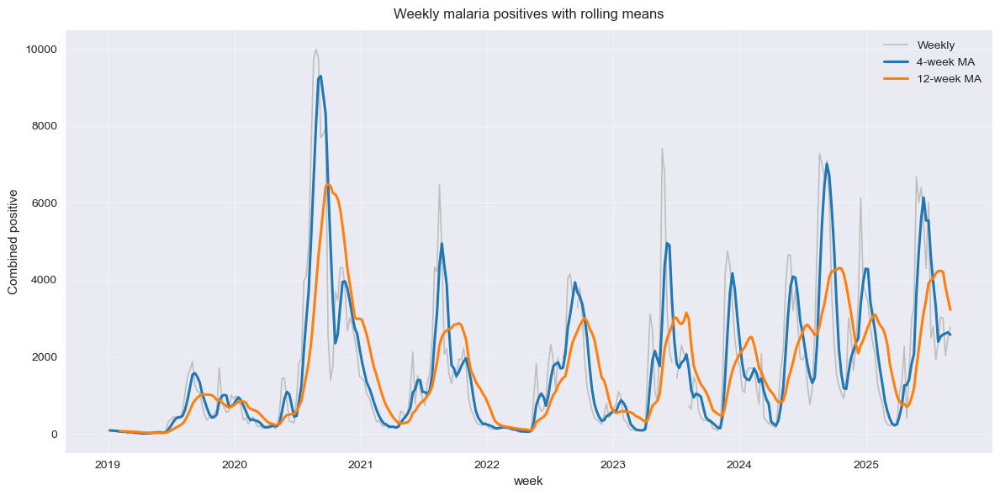
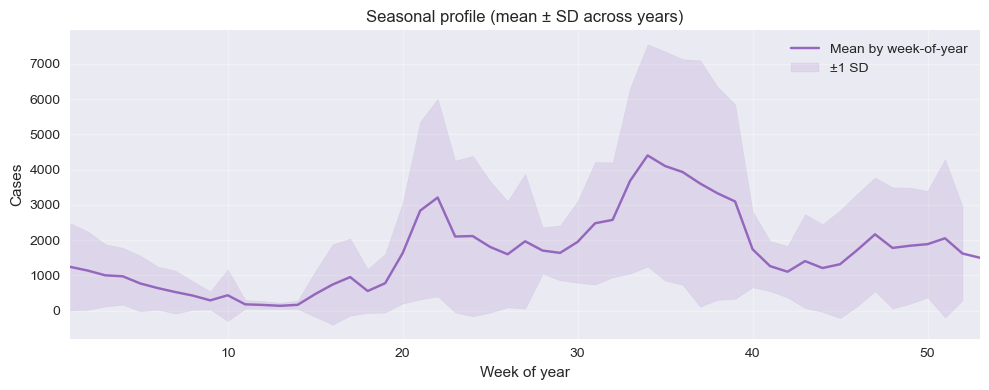
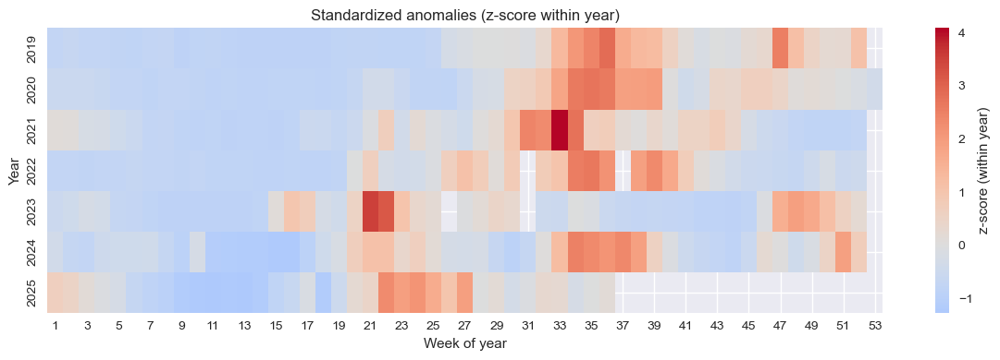
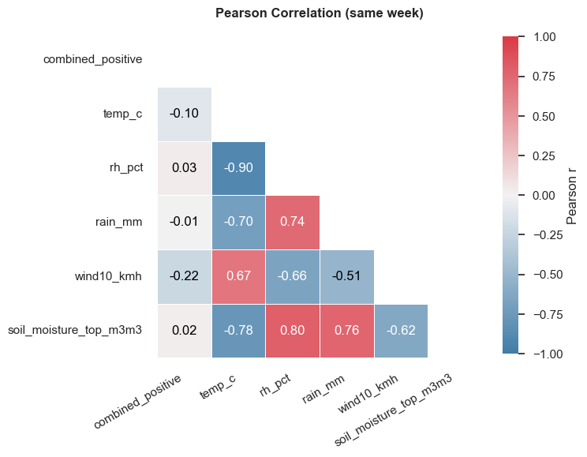
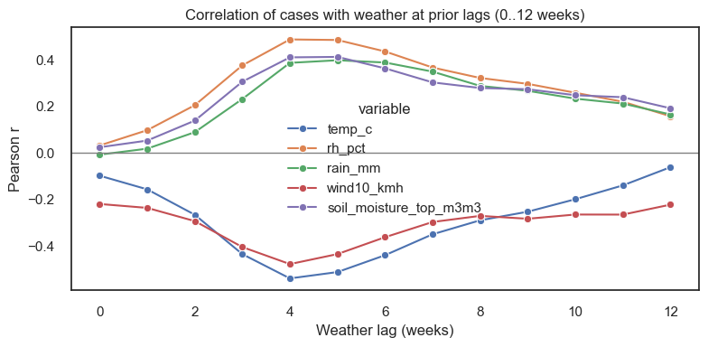
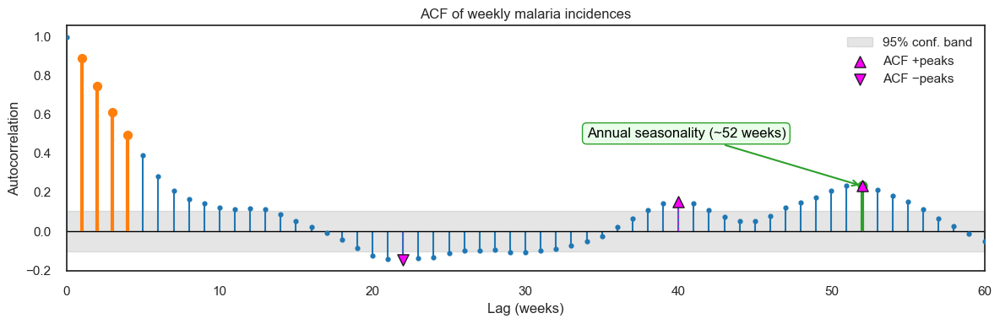
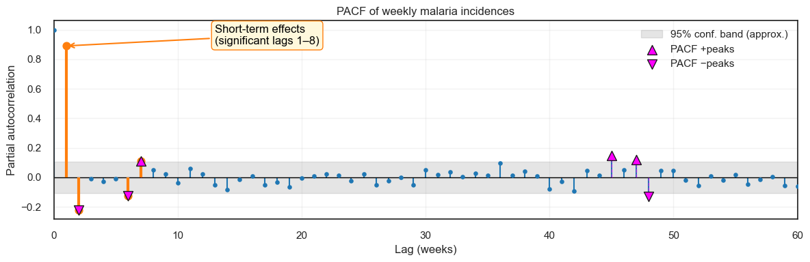
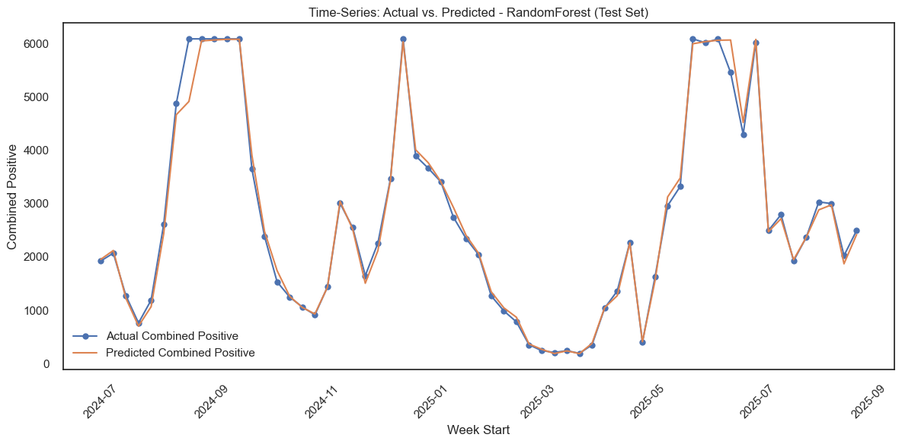
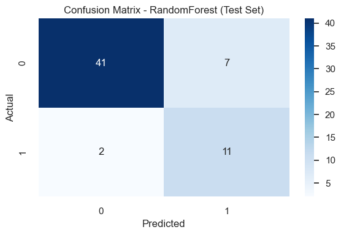

# Malaria Predictive Model 

This README documents the **Business Understanding** for the malaria early‑warning project. It is intended for stakeholders (MoH/County DoH, facility managers, humanitarian partners), the data team, and field implementers (CHWs).

---

## 1) Executive Summary
Kenya’s health system faces a persistent malaria burden; **10 counties account for ~95% of national cases**. Turkana is among the highest‑burden areas, and **Turkana West (Kakuma Refugee Camp) has managed >65,000 malaria cases annually over the past five years**, with increasingly **unpredictable peaks**.

Climate variability has undermined the reliability of rainy seasons in ASAL counties, making responses **reactive and delayed**, driving lost schooling/productivity, stock‑outs, HCW burnout, and avoidable morbidity/mortality (especially in pregnant women and children).

This project proposes a **climate‑informed Early Warning & Response (EWR) platform** that fuses **recent weather signals** (rainfall, temperature, humidity, wind speed) with **historical malaria trends** to forecast outbreak **timing**, and **magnitude**,  **up to 4 weeks** ahead. 

---

## 2) Context & Need
- **Vector–parasite ecology:** Ambient temperatures **> ~18 °C**, standing water, and bushy surroundings accelerate mosquito breeding; in ASAL contexts, these conditions occur after rains.
- **Uncertain seasons:** Shifting onset and intensity of rains in Kakuma have eroded seasonal predictability, **undermining preparedness** and forcing last‑minute responses that overwhelm staff and supplies.

**Why now?** An operational, climate‑aware forecast gives **lead time** to pre‑position diagnostics (RDTs), treatments (ACTs), nets/IRS, and to schedule CHW outreach before peaks.

---

## 3) Problem Statement
> **How can high‑resolution temporal weather data (rainfall, temperature, windspeed, humidity) combined with historical malaria case trends improve the accuracy of short‑term malaria outbreak forecasts in endemic regions?**

---

## 4) Goals & Objectives
- Deliver **actionable 4‑week forecasts** at facility/catchment level.
- Produce **alerts (Outbreak/No outbreak)** to guide programs.
- Enable **data‑driven planning** for MoH/County and partners (stock, staffing, outreach).

### SMART Targets (initial)
- **Lead time:** ≥ 4 weeks ahead of observed peaks for 
- **Forecast quality:** Baseline targets—Regression **MAE ≤ 10–15 cases** per week; **R2 of ≥ 70**, **Least RMSE**. 
- **Operational uptake:** **≥ 80%** of alerts actioned within **7 days** by facilities/CHWs.

---

## 5) Stakeholders & Roles
| Stakeholder | Role in Project | Key Decisions/Actions |
|---|---|---|
| **MoH / County DoH** | Sponsor, governance, integration with surveillance | Approve roll‑out; allocate budget; align with surveillance SOPs |
| **Health Managers (facility/NGO)** | Operational owner | Roster/triage planning; stock pre‑positioning; outreach calendars |
| **CHWs** | Frontline implementers | Door‑to‑door sensitization, net hang‑up, hotspot follow‑up |
| **Humanitarian partners/donors** | Funding & logistics | Targeting, procurement timing, surge staffing |
| **Data team** | Data engineering & modeling | Data pipelines, model training, monitoring & dashboards |

---

## 6) Success Metrics
**Business/Operational**
- **Lead time:** Consistent **4‑week forecasts** at catchment level.
- **Uptake:** % of alerts actioned within **7 days**; **stockout rate** during peaks

**Technical (Forecast Quality)**
- **Regression:** RMSE, MAE, R²
- **Time‑series:** MASE
- **Classification (alerts):** Precision, Recall, **F1**, ROC‑AUC

---

## 7) Scope
**In‑scope**
- Facility‑level malaria case counts & positivity (Kakuma Ward pilot), Open‑Meteo weather (rainfall, temperature, humidity, wind speed).
- Creation of lagged weather features and rolling aggregates.
- Weekly forecasts (option to evaluate daily where data permits).
- Dashboard of predicted Vs actual malaria case counts.

---

## 8) Data Sources & Access
- **Cases:** Facility registers / DHIS2 extracts from Kakuma sites (Malaria microscopy and RDT positives). Custodian: Ministry of Health
- **Weather:** **Open‑Meteo** API (rainfall, temperature, humidity, wind speed). 

> **Access & Security:** During acquisition of data, we followed MoH/County data‑sharing agreements. No personally identifiable information (PII) is required since we used aggregated counts.

---

## 9) Assumptions & Constraints
- Case reporting completeness is ≥ 90% week‑to‑week after basic cleaning/imputation.
- Weather feeds are programmatically retrievable and stable.
- Initial history available: **3–5 years** (longer history improves seasonal modeling).

**Constraints**
- There is an expected class imbalance (many low weeks, few peaks) and this  will affect thresholding and evaluation.
- Limited local compute; We therefore use **lightweight models** initially; scale up recommended for more complex models.

---

## 10) Risks & Mitigations
| Risk | Impact | Mitigation |
|---|---|---|
| Missing/incomplete case data | Bias/poor forecasts | Automated checks; imputation; data quality dashboards |
| Weather API downtime | Gaps in features | Redundant sources; caching; retry logic |
| Class imbalance | Over‑prediction of low risk | Use AUPRC monitoring; calibrated thresholds; re‑sampling |
| Black‑box concerns | Low trust/adoption | SHAP/LIME explanations; clear SOPs per risk tier |

---

## 11) Exploratory Data Analysis (EDA) Plan
**Objectives**
1. Characterize **trends, seasonality, and variability** in cases per facility.
2. Quantify **lag relationships** between weather variables and cases.
3. Assess **data quality** (missingness, outliers, reporting gaps) and **class imbalance**.
4. Produce **baseline metrics** to guide modeling targets and thresholds.

**Guiding Questions**
- What are the **peak weeks/months** and how stable are they year‑over‑year?
- Which **weather lags** (e.g., rainfall 2–4 weeks prior) correlate most with cases?


**Analyses & Visuals**
- Line plots: cases vs. time (per facility, aggregated).
- Seasonal decomposition (STL) and autocorrelation (ACF/PACF).
- Cross‑correlation of cases vs. lagged weather features.
- Heatmaps of correlation matrix (raw and lagged).
- Distribution plots: weekly cases; **class imbalance** view.
- Missingness matrix/heatmap; outlier detection summary.

**EDA Deliverables**

### 11.1 Weekly trend with rolling averages


**What it shows:** Clear seasonal peaks most years and a gradual uptick in the recent baseline. This supports planning **before** peak weeks.

### 11.2 Seasonal profile across the year


**What it shaows:** Two notable high‑risk windows emerge each year. Programs can time LLIN/IRS campaigns, CHW outreach and stock levels to precede these windows.

### 11.3 Off‑season anomalies (heatmap)


**What it shows:** Weeks with unusual spikes (red) signal potential outbreaks; these visuals are helpful for rapid reviews.

### 11.4 Weather relationships


**What it shows:** Same‑week correlations with weather are weak, but **lagged** effects matter.



**What it shows (lag effects):**
- Rainfall and humidity show **stronger links 4–5 weeks later**, consistent with mosquito breeding cycles.
- Cooler prior weeks (≈4 weeks earlier) often precede higher malaria, while higher winds can suppress vector survival.

### 11.5 Time‑series structure




**What it shows:** The series has short‑term persistence (this week depends on the recent weeks) and an annual cycle.

### 11.6 Seasonal decomposition

A **multiplicative (log‑scale) seasonal pattern** fits best, leaving near‑white‑noise residuals and supporting seasonal modeling on a log scale.

---
## 12) Feature Engineering

This was done by creating signals that the model could learn from. These signals were products of the EDA and had helped us to understand our data better. They included: 
 
- **Seasonality fingerprints** – calendar month and week‑of‑year mapped into smooth sine/cosine curves so the model “knows” where we are in the seasonal cycle.
- **Recent momentum** – 4, 8 and 12‑week moving averages/variability of malaria cases to capture short‑term drifts.
- **Weather lags** – prior weeks’ rainfall, humidity, temperature, wind and soil moisture, since effects are delayed.
- **Interactions** – e.g., **rain × soil moisture** and **temperature × humidity** to reflect breeding ecology of mosquitoes. 
- **Spike ratio features** – whether next week looks ≥50% higher than this week (for alert classification).

All of these were derived from the merged weekly dataset and kept only when they added unique signal (we screened out highly overlapping variables).

Code snippets
### 12.1 Seasonality (Fourier terms)

```python
# Month and ISO week-of-year encodings
X['month'] = X.index.month
X['woy'] = X.index.isocalendar().week.astype(int)
X['sin_month'] = np.sin(2*np.pi*X['month']/12)
X['cos_month'] = np.cos(2*np.pi*X['month']/12)
X['sin_week']  = np.sin(2*np.pi*X['woy']/52)
X['cos_week']  = np.cos(2*np.pi*X['woy']/52)
```

### 12.2 Recent momentum (rolling windows)

```python
for w in [4, 8, 12]:
    X[f'cp_roll_mean_{w}'] = y.rolling(w, min_periods=2).mean()
    X[f'cp_roll_std_{w}']  = y.rolling(w, min_periods=2).std()
```
### 12.3 Lagged weather & interactions
```python
# Lags informed by cross-correlation analysis (~4–5 weeks)
for lag in [4, 5]:
    for v in ['rain_mm', 'rh_pct', 'temp_c', 'wind10_kmh', 'soil_moisture_top_m3m3']:
        X[f'{v}_lag{lag}'] = features[v].shift(lag)

X['rain_soil_interaction'] = X['rain_mm'] * X['soil_moisture_top_m3m3']
X['temp_rh_interaction']   = X['temp_c'] * X['rh_pct']
```

### 12.4 Surge classification targets

```python
ratio = y.shift(-1) / y
y_cls = (ratio >= 1.5).astype(int)
```


---
## 13) Modelling approach

We trained two complimentary models since our problem needed both regression and classification.

1. **Regression (How many cases?):** Random Forest predicted weekly counts. Performance was then compared to a simple “last week = this week” baseline using **MASE** (lower is better), plus **RMSE** and **R²**.
2. **Classification (Is a surge likely?):** In this model, random Forest estimated the probability that **next week ≥ 1.5×** this week. Because true spikes are rare, we used **time‑series block oversampling** and evaluated with **Precision‑Recall** in addition to ROC.

**Time series split** was used to avoid future variables in the training sample the  
- **train‑/test split** was done (training up to **June 30, 2024**, testing from **July 1, 2024** onward) and **time‑series cross‑validation** during tuning.



---

## 14) Evaluation 

- **Regression (test period):** MASE ≈ **0.23**, **R² ≈ 0.99**, **RMSE ≈ 193** – meaning predictions are much better than the naive “last week = this week,” and they track levels closely during the test window.
- **Classification (alerts):** ROC‑AUC ≈ **0.87**. Using the **Precision‑Recall‑optimized threshold ≈ 0.21**, we achieved **Precision ≈ 0.61** and **Recall ≈ 0.85** on spikes ≥50% week‑over‑week. This balances catching most surges while keeping false alarms manageable.

> **Operational note:** Thresholds are adjustable. Programs can favor **higher recall** (catch more surges, tolerate more false alerts) or **higher precision** (fewer false alerts, risk missing some surges) depending on resources.



- Regression: MASE ~ 0.23, R^2 ~ 0.99, RMSE ~ 193
- Classification (PR-optimized ~0.21): Precision ~ 0.61, Recall ~ 0.85, ROC-AUC ~ 0.87

---

## 15) Reproducibility

Environment: Python >= 3.10. Key libraries: pandas, numpy, scikit-learn, matplotlib, seaborn, statsmodels, scipy, joblib.

Steps:

1) Put malaria and weather CSVs under Data/.
2) Run preprocessing/merge notebook or script to produce weekly dataset.
3) Train models with the pipeline (GridSearchCV + TimeSeriesSplit).
4) Save models to Models/ and export plots to readme_assets/.
5) Re-run weekly to update thresholds and monitor drift.

---
## 16) Limitations and Next Steps

- Reporting delays/outliers; consider robust smoothing and nowcasting.
- Intervention shifts (IRS/LLIN, CHW campaigns) may change relationships; add flags.
- Consider SARIMAX/Prophet, gradient boosting, or probabilistic forecasts.
- Extend to spatial hierarchies (facility/village).

Visit the [Malaria Outbreak Predictor](https://kakumamalariapredictor-e4116b68755a.herokuapp.com/) to test the live model.

Contributors 
1. Hezron Rumenya 
2. Joackim Kisienya
3. Eric Ongau
4. Lynn Kyalo
5. Newton Njeri
6. Sila Monthe